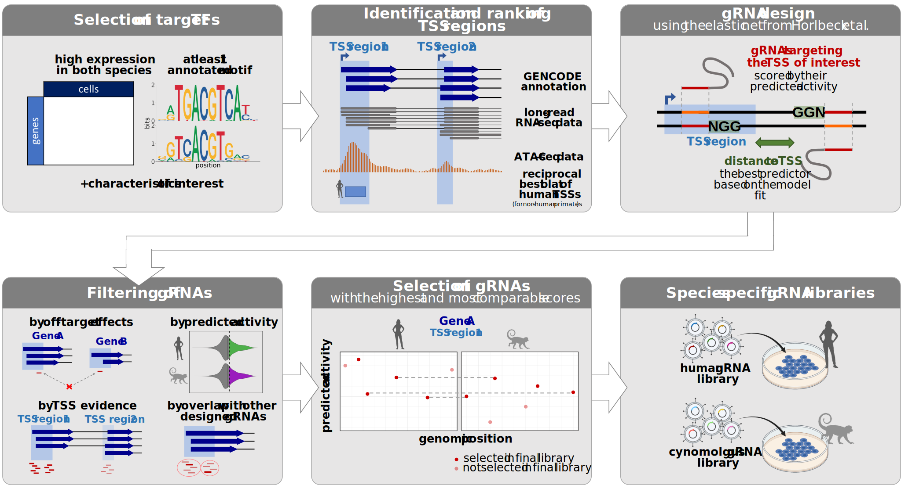

# Cross-species gRNA-design

## Introduction

This is a detaled documentation of the ***Cross-species gRNA design*** shiny app created for the Perturb-seq project of the Hellmmann-Enard Lab. As part of this project, we plan to perturb a selection of transcription factors (TFs) using single-cell CRISPRi screens in primate iPS cells, infer gene regulatory networks (GRNs) based on the outcome of the perturbations, then quantitatively compare these GRNs aross species. 

The main steps of the experimental design are summarised on *Figure 1*. We selected TFs based on previous data that might be interesting to perturb, identified their transcriptional start sites (TSSs) in the human and cynomolgus macaque genomes, then designed single-guide RNAs (gRNAs) using the model published in [*Horlbeck, 2016*](#1) to target these genomic loci. We compiled species-specific libraries by selecting gRNAs with the highest and most comparable predicted activity scores across species. These libraries will be transduced into human and cynomolgus macaque iPS cell lines that inducibly express dCAs9-KRAB to achieve TF perturbations. Later we would like to expand the spectrum of the species to the gorilla and orang-utan as well.

  

  
<em><strong>Figure 1.</strong> Main steps of the TF selection and gRNA design</em>

  
We considered only those genes as potential targets that fulfilled certain basic criteria:

 - located on an autosome
 - annotated as a transcription factor with at least one associated motif (based on the [JASPAR 2022 vertebrate core and unvalidated collections](#2) and the [IMAGE database](#3))
 - has TSSs with sufficient evidence in both the human and the cynomolgus macaque genomes (hg38 and macFas6, respctively)
 
We found 1109 TFs that passed these criteria, these are the ones included in the app. We then selected 76 TFs – corresponding to 80 TSSs – based on various characteristics (expression levels, robustness and cross-species conservation of regulons in co-expression networks, protein sequence conservation, TF family annotations and functional importance in iPSCs). The gRNA libraries contain 4 gRNAs for each of these 80 TSS and each of the 2 species, as well as non-targeting gRNAs as negative controls. 

The app aims to present all characteristics we collected for the 1109 candidate TFs, the designed gRNAs and our final selections in an easily searchable and visual way.
  
## Data

All data files and scripts required to run the app are available at 

## Input parameters

### Expression and module robustness cutoffs

Minimum expression and mosule robustness required for the target genes.

- **Expression measure:** The % of cells expressing a given TF in the human/cyno iPS cells based on unpublished scRNA-seq data.
- **Module robustness measure:** The robustness/preservation of the TF regulons based on the human and cyno early neural differentiation lineage in our unpublished scRNA-seq data. We considered two aspects of robustness, originally described in [Langfelder et al, 2008](#4):
  1. Density: How well-connected are the genes of the regulon overally?
  2. Connectivity: How consistent are the interaction patterns inferred within the module if we compare them across biological replicates from the same species?  
- The histograms show the expression and module robustness distributions for all TFs that passed our basic criteria and have available expression data.
- The darkgrey colouring on the histograms indicates TFs that pass the cutoff in the given species.
- To be included for the further analysis, TFs have to pass the cutoff in both species.

### Target gene

- Normally, the drop-down menu contains all TFs that passed the basic criteria, have available expression data and are above the expression and module robustness cutoffs.
- If both cutoffs are set to the minimum (expression cutoff = 0 and module robustness cuotff = -3), the drop-down menu contains all TFs that passed the basic criteria, regardless of whether we have expression data about them or not.
- An interactive plot of cross-species regulatory network conservation is displayed to aid the choice of TFs. Mouse over data points to find out which are the TFs with the most conserved/diverged regulons.

### Genome

For each gene, gRNAs were designed in both the human (hg38) and the cyno (macFas6) genome. Choose a genome to decide which design should be displayed.

### Include Horlbeck design?

If set to yes, the gRNAs from *Horlbeck et al., 2016* (lifted over from hg19 to hg38) are also displayed in the hg38 genome alongside our own design.

### Padding for genomic region

The number of bps to display on both sides of the promoter region for the chosen TF on the Gviz plot.

## Output - TF characteristics
 
### Expression in iPSCs

The same histogram as before, with the expression of the chosen TF marked in red.
  
### Module robustness

The same histogram as before, with the robustness measure of the chosen TF marked in red.
  
### Cross-species conservation:

Conservation of the TF regulons between human and cyno based on the early neural differentiation lineage in our unpublished scRNA-seq data. We considered two aspects of conservation, originally described in [Langfelder et al, 2008](#4):
  1. Density: Does a module that is well-connected in one species also stay well-connected in another species?
  2. Connectivity: Do interaction patterns inferred within the module if we compare them across biological replicates from the same species?
    
### TFBS motifs

TFBS motif logos based on the information content matrices for each annotated motif of the TF. The full-length information contents are displayed below the plot.
  
### Protein sequence conservation

Mean phastCons score of the TF CDS based on multiple alignments of 29 primate genome sequences to the human genome (phastCons30way). The histogram shows the distribution of the meanCons scores of all genes in the drop-down menu, the score of the chosen TF is marked in red.
  
### Functional annotation

Annotated GO terms for the chosen TF. Terms describing TF activity or DNA binding and terms that are not end nodes in the GO hierarchy were excluded.
  
### Primate- and human-specific paralogs

Paralogs from the BioMart database. 
  
## Output - gRNA selection

### Gviz plot

A plot displaying the genomic region around the TSSs of the chosen gene. The width of the region can be adjusted via the input parameter *Padding for genic region*.

Tracks:

- **GENCODE annotation**: Human (GRCh38.p13) or cynomolgus macaque (Macaca_fascicularis_6.0.105) reference annotation for the gene of interest. If the chosen gene has an annotated symbol, the transcripts are filtered by the symbol, otherwise the transcripts are filtered by the genomic region and strand.
- **Long-read RNA-seq data**: Nanopore reads and coverage from human and cynomolgus iPS cells.
- **Designed gRNAs**: The targeted genomic positions and predicted activity scores of the designed gRNAs.
- **ATAC-seq data**: ATAC-seq peaks from human and cynomolgus iPS cells (two individuals for each of the species).

### Scores & positions for the gRNAs

An interactive plot displaying the targeted genomic positions and predicted activity scores of the designed gRNAs for each of the TSS regions. 

- gRNAs selected in the final CRISPRi library are marked by green, the ones not selected are coloured red. 
- If the *Include Horlbeck design?* input parameter is set to *Yes*, the gRNAs from [*Horlbeck, 2016*](#1) are also displayed (coloured black). Please note that the scores from the Horlbeck design and the scores from our own design are not directly comparable, because they are calculated based on slightly different models. For our purposes, the published model was re-trained using ATAC-seq peaks from human and cynomolgus iPS cells as accessibility data.
- gRNAs can be selected by clicking or brushing data points with the mouse. Detailed information about the selected gRNAs will appear in the table below.

### Selected gRNAs

A table summarising the available information about the gRNAs selected by the user.

Table entries:

- **sgID**: Unique identifier of the gRNA in the chosen genome (format: geneName_strand_genomicPosition.lengthWithPAM-tssId).
- **source**: The design where the gRNA was found.

  - horlbeck: the gRNAs in Horlbeck et al., 2016 lifted over from hg19 to hg38
  - hg38 design: our own design for hg38
  - mf6 design: our own design for macFas6
- **tss_id**: The transcriptional start site (TSS) region that the gRNA targets. We identified the TSSs by integrating evidence from the GENCODE annotation, long read RNA-seq and bulk ATAC-seq data as well as reciprocal best BLAT hits of the human TSS in case of the non-human primates. The TSS were ranked based on available evidence, with a lower number meaning more evidence, and named according to the ranks (format: geneName_rank). For the gRNA design, we merged TSSs of a gene that are closer than 1kb into TSS regions. We refer to these regions by the concatenated names of the merged TSSs (format: geneName_rank1,geneName_rank2).
- **predicted_activity**: Activity score calculated based on Horlbeck et al., 2016. 

  Model:

  - in case of source 'horlbeck': the original elastic net in Horlbeck et al., 2016
  - in case of source 'hg38 design' and 'mf6 design': a modified version of this elastic net trained with only one type of accessibility data (human iPSC ATAC-seq data as a replacement of the original DNase data)
  
  The scores are within the range [0, 1] with a higher score meaning a higher activity/more efficient knock-down. The strongest predictor of the activity is the position relative to the TSS, including both distance from the TSS and avoidance of canonical nucleosome-occupied regions.

- **off_target_stringency**: The level of the most stringent off-target filter the gRNA passed, with a lower level meaning a more stringent filter/less off-target effects.

  Filters applied:

  - 31_nearTSS: passed if there is no off-target site within the TSS regions with a mismatch threshold of 31
  - 21_genome: passed if there is no off-target site within the whole genome with a mismatch threshold of 21
  - 31_2_nearTSS: passed if there is <=1 off-target site within the TSS regions with a mismatch threshold of 31
  - 31_3_nearTSS: passed if there are <=2 off-target sites within the TSS regions with a mismatch threshold of 31
  
  Levels:

  - 0: the gRNA passed the filters 31_nearTSS & 21_genome
  - 1: the gRNA passed the filter 31_nearTSS but not 21_genome
  - 2: the gRNA passed the filter 21_genome but not 31_nearTSS
  - 3: the gRNA passed the filter 31_2_nearTSS but not 31_nearTSS or 21_genome
  - 4: the gRNA passed the filter 31_3_nearTSS but not 31_nearTSS, 21_genome or 31_2_nearTSS
  
  If a gRNA does not pass any of these filters, it is discarded from the design output.

- **gRNA sequence**: The 20-nt long sequence of the gRNA. In case of source 'horlbeck', this means the original hg19 sequence which occassionally differs from the sequence at the position where the gRNA is displayed in hg38 genome space.

- **match_in_other_genome**: Category based on the matching between the gRNAs designed for hg38 (horlbeck + own design) and the gRNAs designed for mf6.

  - zero_mismatch: the gRNA has a perfectly matching counterpart in the other library
  - one_mismatch: the gRNA has a counterpart with 1 mismatch in the other library
  - no_cyno_gRNA/no_human_gRNA: the gRNA does not have a match with ≤1 mismatch in the other library

- **is_in_lib**: 'Yes' if the gRNA is in the final CRISPRi library, 'No' if it is not. We designed two species-specific libraries, one for human and one for cynomolgus, each of them contains 4 gRNAs per TSS region. Both effectiveness (high predicted activity scores) and comparability (similar predicted activity scores in the two species) was taken into account when compiling the libraries.

New gRNAs can be added to table by selecting data points on the *Scores & positions for the gRNAs* plot. The entries can be cleared using the button *Clear selected*. The table can also be searched, filtered and exported.

## References
<a id="1">[1]</a> 
Horlbeck, M. A., Gilbert, L. A., Villalta J. E. *et al*. (2016). **Compact and highly active next-generation libraries for CRISPR-mediated gene repression and activation** *eLife* **5**:e19760.

<a id="2">[2]</a> 
Castro-Mondragon J. A., Riudavets-Puig R., Rauluseviciute I. *et al*. (2022) **JASPAR 2022: the 9th release of the open-access database of transcription factor binding profiles** *Nucleic Acids Research* **50**:D165–D173.

<a id="3">[3]</a> 
Madsen J. G. S., Rauch A., Van Hauwaert E. L. *et al*. (2018) **Integrated analysis of motif activity and gene expression changes of transcription factors** *Genome Res.* **28**:243-255.

<a id="4">[4]</a> 
Langfelder P., Luo R., Oldham M. C., Horvath S. (2008) **Is my network module preserved and reproducible?** *PLoS Comput Biol*. **7**:e1001057
